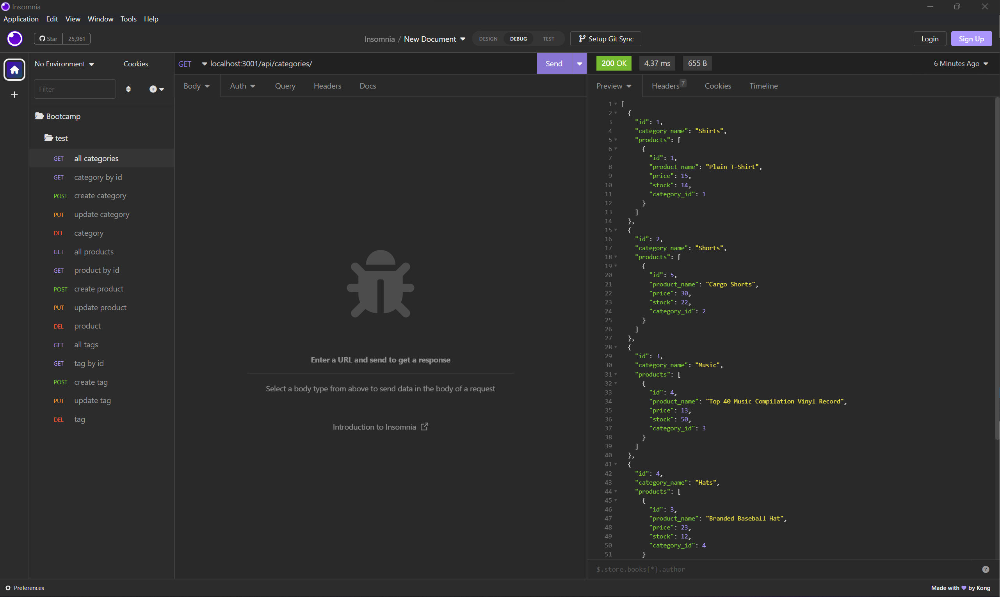

# e-commerce-back-end

## Description

A back end application to create, update, delete, and check products, categories, and tags.

## Table of Contents

- [Installation](#installation)
- [Usage](#usage)
- [Credits](#credits)
- [License](#license)

## Installation

- dotenv version 8.2.0
- express version 4.17.1
- mysql2 version 2.1.0
- sequelize version 5.21.7

## Usage

Create schema through MySQL shell, send seed to database, then you can create, update, delete, or check everything through insomnia.

video: https://drive.google.com/file/d/1WS4gkliv-ZSl_slPvwUPLlRtex-LqrAk/view?usp=share_link

## Credits

- Rutgers University Coding Bootcamp

## License

N/A
